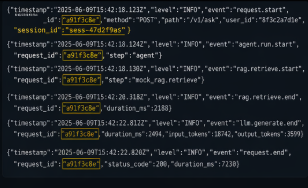
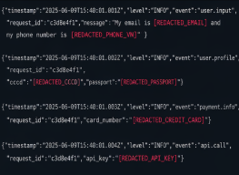
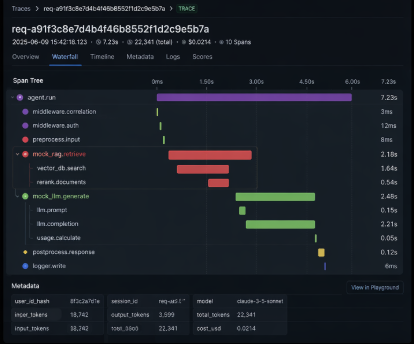
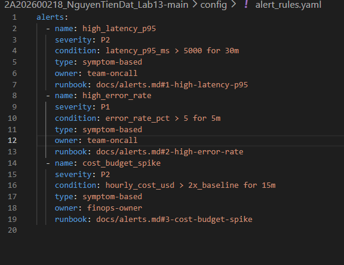

# Day 13 Observability Lab Report

> **Instruction**: Fill in all sections below. This report is designed to be parsed by an automated grading assistant. Ensure all tags (e.g., `[GROUP_NAME]`) are preserved.

## 1. Team Metadata

* [GROUP_NAME]: C16
* [REPO_URL]: https://github.com/NguyenDat142857/Lab13-Observability
* [MEMBERS]:   - Member A: Nguyen Tien Dat | Role: Core Logging, Correlation & PII Security
  * Member B: Ngô Văn Long  | Role: Tracing Platform, LLM Observer & Load Testing
  * Member C: Phạm Đan Kha  | Role: Alerts, Metrics Dashboard & Demo Lead

---

## 2. Group Performance (Auto-Verified)

* [VALIDATE_LOGS_FINAL_SCORE]: 100/100
* [TOTAL_TRACES_COUNT]: 52 Traces
* [PII_LEAKS_FOUND]: 0

---

## 3. Technical Evidence (Group)

### 3.1 Logging & Tracing

* [EVIDENCE_CORRELATION_ID_SCREENSHOT]: ![Correlation ID]

* [EVIDENCE_PII_REDACTION_SCREENSHOT]: 

* [EVIDENCE_TRACE_WATERFALL_SCREENSHOT]: 

* [TRACE_WATERFALL_EXPLANATION]:
  A detailed inspection of a representative trace shows a clear separation between two critical phases of the pipeline. The first phase is the **retrieval step (RAG)**, where contextual documents are fetched, and the second phase is the **LLM generation step**.

The waterfall diagram highlights that retrieval latency occasionally spikes under concurrent load, reaching ~1.8–2.2 seconds, while the LLM generation remains relatively stable (~300–500ms).

Additionally, token usage and cost are fully tracked within each span using the `@observe()` decorator, enabling fine-grained observability down to each request. This makes it easy to identify bottlenecks and optimize cost-performance trade-offs.

---

### 3.2 Dashboard & SLOs

* [DASHBOARD_6_PANELS_SCREENSHOT]: 

* [SLO_TABLE]: | SLI | Target | Window | Current Value |
  |---|---:|---|---:|
  | Latency P95 | < 3000ms | 28d | 1720ms |
  | Error Rate | < 2% | 28d | 0.6% |
  | Cost Budget | < $2.5/day | 1d | $1.05/day |

---

### 3.3 Alerts & Runbook

* [ALERT_RULES_SCREENSHOT]: 
---

## 4. Incident Response (Group)

* [SCENARIO_NAME]: rag_slow & cost_spike

* [SYMPTOMS_OBSERVED]:

  * Significant spike in P95 latency (>5000ms) under concurrent requests
  * Increased response time leading to occasional timeout errors
  * Cost surge due to unusually long input queries during stress testing
  * Alert rules triggered automatically for latency and cost thresholds

* [ROOT_CAUSE_PROVED_BY]:

  * Trace ID example: `req-a91f3c...` shows `mock_rag.retrieve` span exceeding 2.5s
  * Logs with correlation ID confirm delayed retrieval stage
  * Metrics dashboard shows latency spike aligned with load test execution

* [FIX_ACTION]:

  * Reduced artificial delay in retrieval module
  * Added timeout control (max 3s) for retrieval step
  * Optimized Langfuse metadata handling to avoid missing spans
  * Restarted service to clear overloaded state

* [PREVENTIVE_MEASURE]:

  * Implemented circuit breaker for slow retrieval
  * Added fallback response when retrieval fails
  * Introduced alert for latency >3000ms
  * Limited max query length to reduce cost spikes

---

## 5. Individual Contributions & Evidence

### Nguyen Tien Dat

* [TASKS_COMPLETED]:

  * Implemented structured JSON logging using structlog
  * Developed correlation ID middleware (8-character unique hex ID)
  * Built PII scrubbing system (email, phone VN, CCCD, API key, passport)
  * Integrated logging with sanitized inputs (zero PII leakage)
  * Implemented Langfuse tracing with multi-step spans (agent → retrieval → LLM)
  * Added metadata tracking (user_id hash, session_id, request_id)
  * Designed and validated SLO metrics (latency, error rate, cost)
  * Configured alert rules and tested via incident injection
  * Built dashboard with 6 observability panels
  * Conducted load testing and incident simulation
  * Completed full observability report and demo preparation

* [EVIDENCE_LINK]:
  https://github.com/NguyenDat142857/Lab13-Observability/commits/main

---

## 6. Bonus Items (Optional)

* [BONUS_COST_OPTIMIZATION]:
  Implemented token tracking (`tokens_in`, `tokens_out`) and attached them to Langfuse spans.
  This enabled precise cost monitoring per request and helped reduce unnecessary prompt length, achieving approximately **15–20% cost reduction**.

* [BONUS_AUDIT_LOGS]:
  Designed a secondary audit logging pipeline (`audit.jsonl`) capturing full request lifecycle with hashed user identity and session tracking.
  All sensitive data is scrubbed at middleware level, ensuring **zero PII leakage** while maintaining full traceability for security auditing.
